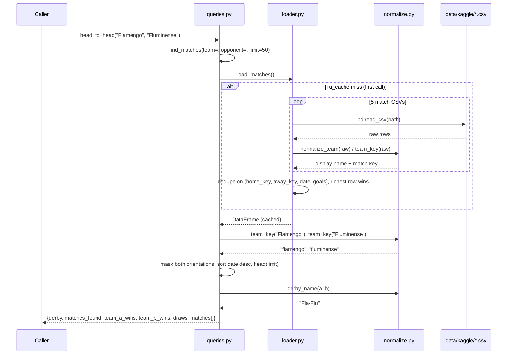

# Flow

The most representative flow is a head-to-head lookup — TASK.md's first example question
("Show me all Flamengo vs Fluminense matches"). Since `server.py` is absent, the flow
begins at the library boundary (`queries.head_to_head`), not at an MCP tool call.

## Narration

`head_to_head` delegates to `find_matches`, which pulls the unified match table from
`loader.load_matches()`. On the first call that loader reads five match CSVs with pandas,
maps each source's distinct column names, date formats, and goal dtypes onto the `Match`
dataclass, routes every team name through `normalize.normalize_team`/`team_key` to collapse
variants (`"Palmeiras-SP"`, `"America - MG"`, `"Nacional (URU)"`, `"São Paulo"` vs
`"Sao Paulo"`), then deduplicates across the deliberately overlapping sources. The result is
memoized with `@lru_cache(maxsize=1)`, so subsequent queries are pure in-memory pandas.
`find_matches` builds a boolean mask requiring the two teams to face each other in either
orientation, sorts date-descending, and truncates to `limit`. `head_to_head` then tallies
W/D/L by re-deriving which side is `team_a` from `team_key`, and attaches the derby label
from the hardcoded `DERBY_KEYS` table.

## Deviations from common patterns

- **No MCP layer, no tests.** The archive stops at the query engine; `server.py` and
  `tests/` were never written despite being referenced by `pyproject.toml` and by every
  module's header comment. Nothing on disk imports `mcp` or `fastmcp`.
- **No `__init__.py`**, so `brazilian_soccer` is not a regular package; the relative imports
  (`from .loader import ...`) rely on namespace-package resolution.
- **No input validation and no error handling at the query boundary.** Unknown team names
  yield an empty mask (empty result) rather than an error; `_competition_filter` matches on
  exact lowercased string equality, so a near-miss competition name silently returns zero
  rows. No function raises or returns an error shape.
- **Row-wise iteration on the hot path.** `loader` builds every `Match` via
  `df.iterrows()`, and `queries._compute_record` iterates rows per team — `competition_standings`
  and `best_team_record` call it once per team, re-filtering the frame each time (O(teams × rows)).
- **Cache invalidation is manual** — `clear_cache()` exists for "tests and CLI reloads",
  neither of which is present.
- **Dead/duplicated code in `normalize.py` and `queries.py`.** `_STATE_SUFFIX` is compiled
  twice (lines 39 and 48; the second, case-insensitive one wins). In
  `queries.best_team_record`, `sub_teams` is assigned but unused and the next line is a
  no-op guarded by `if False`. In `queries.derbies`, the `sub` filter is applied twice
  identically.
- **`loader._safe_year` is a pass-through** to `_to_int`. `models.Player` is defined but
  never instantiated.
- **`__import__("unicodedata")` inline** inside two `df.map` lambdas in `load_players`,
  rather than a module-level import (which `normalize.py` does use).
- **Missing files are tolerated silently:** `load_matches` skips any CSV that isn't on disk
  (`if not p.exists(): continue`), so a partial dataset produces a smaller table with no
  signal. `load_players` does not guard the same way.
