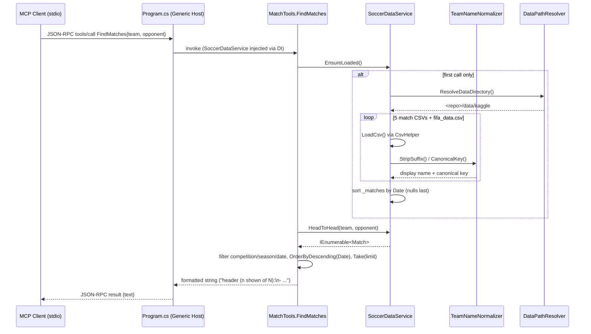

# Flow

The most representative path is an LLM client invoking the `FindMatches` tool
for a head-to-head question ("Show me all Flamengo vs Fluminense matches") — the
first thing a user of this server would hit.

## Narration

The host is a .NET generic `Host` with `AddMcpServer().WithStdioServerTransport().WithToolsFromAssembly()`;
console logging is redirected to stderr so stdout stays reserved for the JSON-RPC
stream. `SoccerDataService` is a DI singleton, so all ten tools share one copy of
the data. Every tool method opens with `_data.EnsureLoaded()`, which is guarded by
a `_loaded` bool — so despite the comment in `Program.cs` describing the service as
eagerly loading CSVs at registration, loading actually happens lazily inside the
first tool invocation, and the first call pays the full parse cost of roughly 24k
match rows plus 18k player rows. Each of the five match files has its own loader
method that maps that file's column names onto the shared `Match` shape and tags it
with a competition label and source filename; team names are passed through
`TeamNameNormalizer` at load time so the canonical key is precomputed on the record
and head-to-head lookups are key equality rather than repeated string parsing.
After all loaders finish, `_matches` is sorted once by date with unparseable dates
pushed to the end.

`FindMatches` branches: with both `team` and `opponent` it delegates to
`HeadToHead`, otherwise it resolves the single team's key and scans. The remaining
filters (`competition`, `season`, `fromDate`, `toDate`) are `Where` clauses over
the full in-memory list — a linear scan per call, with no index beyond the
precomputed team keys and no pagination beyond `limit`/`Take`. Results are
formatted into a plain-text string rather than structured JSON.

## Deviations from common patterns noted in the code

- **Lazy load, not eager**, contrary to the `Program.cs` header comment; the first
  tool call absorbs the entire CSV parse.
- **`EnsureLoaded()` is not thread-safe** — `_loaded` is set before loading begins
  and is guarded by no lock, so concurrent first-calls could read a partially
  populated list.
- **All errors are swallowed at load**: both `LoadCsv` and `LoadFifaPlayers` wrap
  per-row parsing in `catch (Exception)` and skip; a missing file returns silently
  via an `if (!File.Exists(path)) return;`. There is no surfaced count of skipped
  or missing records.
- **No input validation on tool parameters** beyond `Math.Max(1, limit)`;
  unparseable `fromDate`/`toDate` are silently ignored (`DateTime.TryParse` failure
  simply skips the filter rather than reporting a bad argument).
- **Repeated enumeration**: `FindMatches` and `SearchPlayers` call `query.Count()`
  after materializing `results`, re-running the filter chain a second time.
- **Double "Round" prefix**: `SoccerDataService` stores `Round = "Round " + round`
  for two datasets, and `Match.Summary` renders it as `Round {Round}`, yielding
  "Round Round 22" in those tools' output.
- **`GoalDifference` is absolute**, so `BiggestVictories` filters `> 0` and ranks
  by margin regardless of which side won.
- No caching layer, no async I/O (loaders are synchronous `StreamReader` inside a
  synchronous tool method), and no `IClassFixture` sharing in the tests — each test
  class constructs its own `SoccerDataService` and reloads the datasets.
