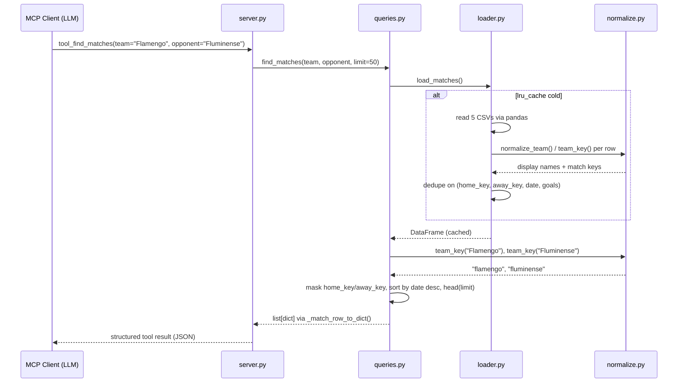

# Flow

The most representative flow is an LLM client calling `tool_find_matches` to answer "Show me all Flamengo vs Fluminense matches" — it exercises the full stack: MCP tool → query engine → cached loader → normalization.

## Narration

A call to `tool_find_matches` passes straight through the `server.py` wrapper into `queries.find_matches`, which calls `loader.load_matches()`. That loader is `@lru_cache(maxsize=1)`, so the first call reads all five match CSVs with pandas, maps each row onto the `Match` dataclass (normalizing team names, coercing goal values through `_to_int`, parsing both ISO and day-first dates), attaches accent-folded `home_key`/`away_key`, concatenates everything into one frame, and deduplicates on `(home_key, away_key, date, home_goal, away_goal)` — preferring rows that carry advanced stats. Every later call reuses that frame. `find_matches` then applies each optional filter with AND semantics: `team`/`opponent` via `team_key`-based boolean masks (with an extra mask ensuring the two teams played *each other* when both are given), `competition` by lowercased exact string match, `season` via a row-wise `int()` comparison tolerating float dtype, `start_date`/`end_date` by coercing the date column with `pd.to_datetime`, and `stage` by lowercased string equality. Results are sorted by date descending with NaNs last, truncated to `limit` (default 50), and projected row-by-row into plain JSON-serializable dicts.

## Deviations from common patterns noted

- **No database, no ORM, no HTTP layer** — all state is two `lru_cache`d pandas DataFrames held in process memory; the transport is MCP stdio.
- **No input validation** — no bounds check on `limit`, no enum validation on `competition`, `venue`, `metric`, or `position_group`; an unrecognized value silently yields an empty or unfiltered result (e.g. `_competition_filter` returns zero rows for a typo; `best_team_record` falls back to `win_rate` for an unknown `metric`).
- **No error handling at the tool boundary** — no try/except in `server.py`; a loader or pandas exception propagates to the MCP client. `load_players()` will raise if `fifa_data.csv` is absent, whereas `load_matches()` silently skips missing match CSVs (`if not p.exists(): continue`).
- **Row-wise Python loops over DataFrames** — `_load_*` functions and `_compute_record` iterate with `df.iterrows()` rather than vectorizing; `competition_standings` and `best_team_record` call `_compute_record` once per team, each re-slicing the frame.
- **`normalize.py` defines `_STATE_SUFFIX` twice** (lines 39 and 48); the second, case-insensitive definition shadows the first.
- **`loader.py` builds the DataFrame with `_MATCH_COLUMNS + ["home_key", "away_key"]`**, duplicating those two names, then drops the duplicates with `~df.columns.duplicated()`.
- **`queries.derbies` applies the same `isin(pair)` mask twice** in succession (lines 521–524); the second filter is a no-op.
- **Imports inside function bodies** — `unicodedata` inside `_ascii_lower`, `DERBY_KEYS` inside `derbies`, `get_data_summary` inside `data_summary`, and `__import__("unicodedata")` inline in `load_players`.
- **Date filters keep null-date rows** — `find_matches` uses `dates.isna() | (dates >= sd)`, so undated matches pass every range filter rather than being excluded.
- **A stale copy of the package exists under `build/lib/brazilian_soccer/`** from a local build.
