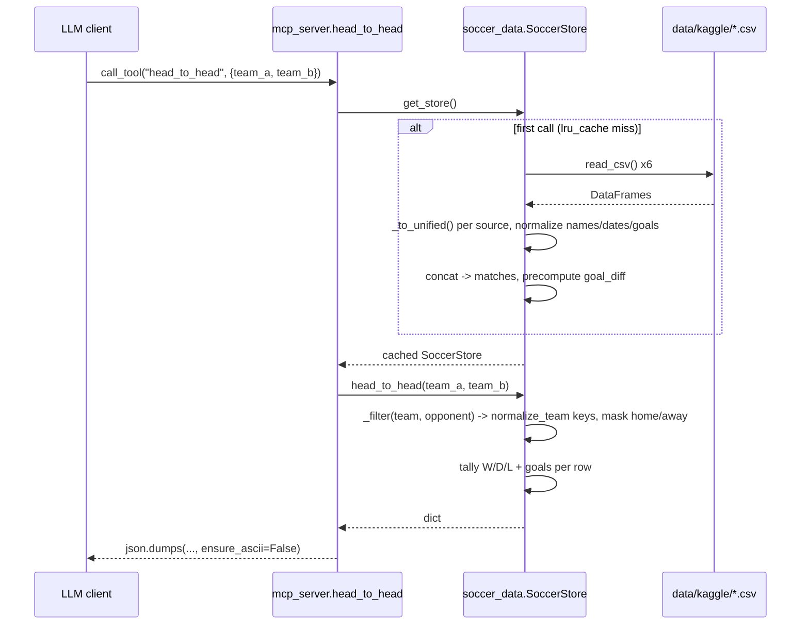

# Flow

A tool call resolves the store through `get_store()`, an `lru_cache(maxsize=1)` singleton
(`soccer_data.py:820`), so the six CSVs are parsed exactly once per process — on first tool
call, or eagerly at startup when launched via `main()` (`mcp_server.py:289`). Loading routes
each source through `_to_unified()`, which projects heterogeneous columns onto a common
schema, resolves every team name through the `CANONICAL_ALIASES` registry into a stable
`home_key`/`away_key`, parses both ISO and Brazilian `DD/MM/YYYY` dates, and coerces goals to
ints. Queries then operate purely on the unified DataFrame and return plain Python
dicts/lists, which the tool layer serializes with `ensure_ascii=False` to preserve
Portuguese accents.

Deviations from common patterns worth noting:

- **Row-wise loading.** `_to_unified()` uses `df.iterrows()` and builds a list of dicts rather
  than vectorized pandas column operations — O(n) Python-level work over ~24k rows. It is
  fast enough here (the full suite loads and runs in ~3.7s) but is not idiomatic pandas.
- **Query methods iterate rows too.** `head_to_head`, `team_stats`, `standings` and
  `best_record` all loop with `iterrows()` rather than using groupby aggregation.
- **No error handling on load.** A missing or malformed CSV raises out of `SoccerStore.__init__`;
  there is no per-file try/except or graceful degradation.
- **Every tool returns a JSON string**, not structured content — a deliberate FastMCP choice,
  consistently applied across all 15 tools.
- **`normalize_team()` is reused for player names and nationalities** (`player_search`,
  `brazilians_at_brazilian_clubs`), so player strings are resolved through the *club* alias
  registry.
