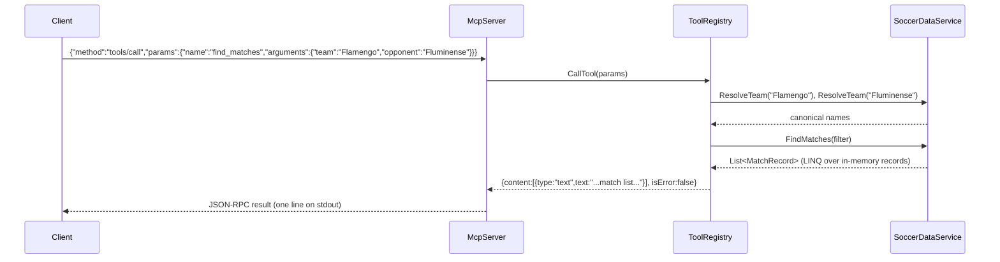

# Flow

At startup `Program.cs` resolves `data/kaggle`, `DataLoader.LoadAll` parses all six CSVs into unified `MatchRecord`/`PlayerRecord` lists (deduplicating overlapping fixtures across files), and `McpServer.RunAsync` reads newline-delimited JSON-RPC from stdin. A `tools/call` request is dispatched to the named tool handler in `ToolRegistry`, which parses/validates arguments, resolves team and competition names through `TeamNameNormalizer`-backed lookup (unknown or ambiguous names raise `TeamResolutionException`, returned as `isError` text content rather than a protocol error), runs LINQ queries over the in-memory data, and formats a plain-text answer in the spec's suggested layouts. All queries are synchronous in-memory scans — no database, no external APIs.
