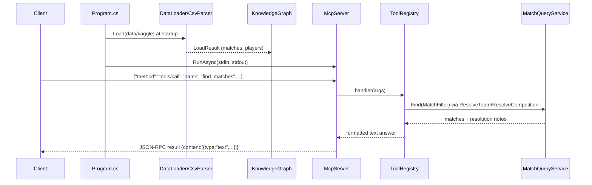

# Flow

At startup `Program.Main` resolves the data directory (arg, `BRAZILIAN_SOCCER_DATA_DIR`, or upward search), loads all five CSVs eagerly through `DataLoader`/`CsvParser`, and builds the `KnowledgeGraph` (normalized team keys, alias resolution) before serving. `McpServer.RunAsync` then reads line-delimited JSON-RPC from stdin; a `tools/call` for `find_matches` dispatches through `ToolRegistry` to `MatchQueryService.Find`, which resolves fuzzy team/competition names (surfacing "did you mean" notes), filters the unified match list, and returns a plain-text summary. Deviations: all data is loaded synchronously in memory at startup (no lazy loading); tool results are text-only, not structured JSON; malformed requests return JSON-RPC error objects rather than crashing; diagnostics go to stderr to keep the stdout protocol channel clean.
