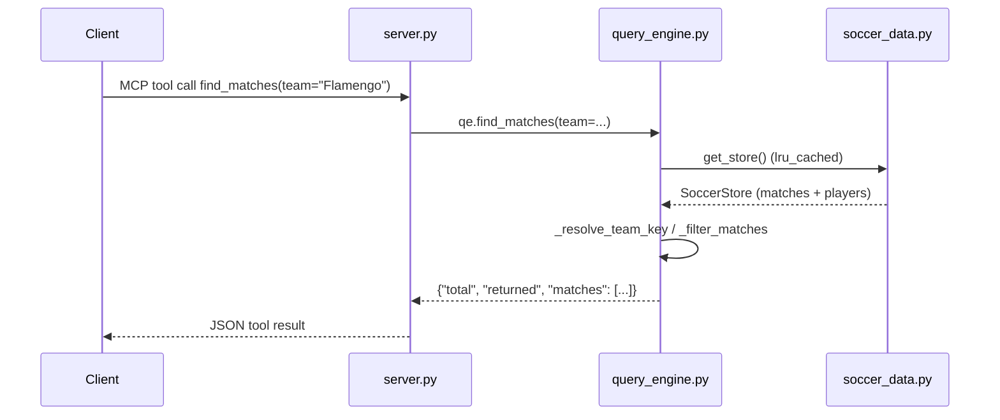

# Flow

A tool call reaches the thin `@mcp.tool()` wrapper in `server.py`, which delegates to the matching `query_engine` function. The engine lazily loads the cached `SoccerStore` (all six CSVs parsed, team names normalised, cross-source duplicate fixtures collapsed), filters the `played_matches` DataFrame with pandas boolean masks, and serialises the head of the result to plain dicts. Notable: every match row serialisation calls `_team_name`, which rebuilds the full display-name map (`_display_names` does a groupby over all matches) — correct but repeated work per row; results are still returned well within the spec's latency targets per the passing tests. Input validation exists for venue and competition (explicit `ValueError`s); unknown teams degrade to empty results rather than erroring.
