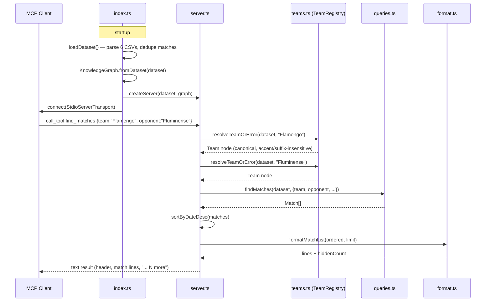

# Flow

At startup, `index.ts` loads all six Kaggle CSVs into a unified, deduplicated `Dataset`, builds the in-memory `KnowledgeGraph`, and connects the MCP server over stdio. On a `find_matches` call, `server.ts` first resolves each free-text team name through the `TeamRegistry` (normalizing accents, state suffixes and alias spellings) — unresolvable names return an `isError` text result rather than a thrown error. It then delegates to the pure query function `findMatches` in `queries.ts`, sorts results most-recent-first, and renders them via `format.ts` with a truncation note when results exceed the limit (default 20).

Deviations from common patterns: all data is held in memory and queries are synchronous inside async handlers (fine at this dataset size, no streaming/pagination beyond a `limit` cap); date-range inputs are compared as raw strings rather than validated as dates; tool errors are conveyed via `isError` text results, so malformed filter values (e.g. an invalid `dateFrom`) silently narrow results instead of erroring.
