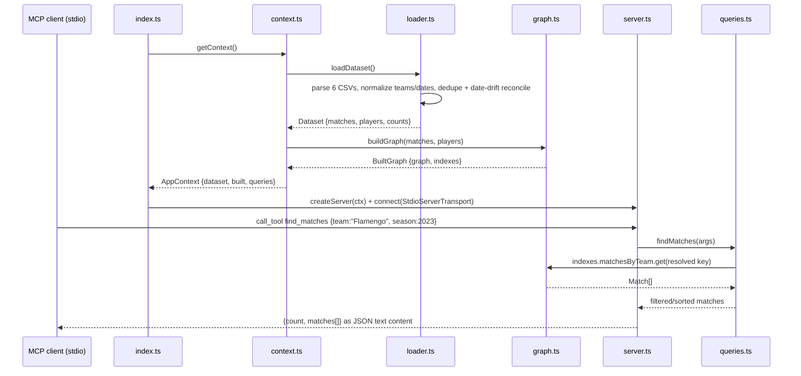

# Flow

At startup, `index.ts` calls `getContext()`, which loads all six Kaggle CSVs through `loader.ts` (normalizing team names, dates, and competition labels via `normalize.ts`, deduplicating across sources by `date|home|away` key, then a date-drift reconciliation pass that merges same-fixture records up to 2 days apart, and a league-season integrity pass), builds the in-memory `KnowledgeGraph` plus lookup indexes in `graph.ts`, and wires a `SoccerQueries` instance. `createServer()` registers 15 zod-typed MCP tools and one resource over that context, served on stdio. A `find_matches` call resolves the free-text team name to a canonical key, pulls that team's matches from the pre-built index, applies opponent/competition/season/date/venue/round/stage filters, and returns up to `limit` (default 50, max 500) formatted matches as pretty-printed JSON in one text block. Notable characteristics: the whole dataset lives in memory (no DB); the context is a module-level singleton when no `dataDir` is passed; tool handlers do no try/catch — invalid input is left to zod, and only `league_standings` returns an explicit MCP `isError` (empty result set).
