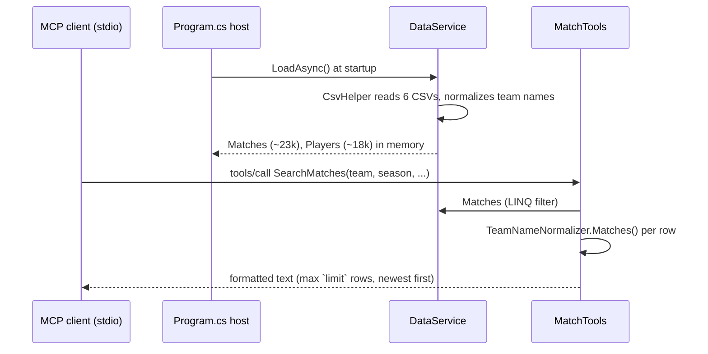

# Flow

At startup the host eagerly loads all six CSVs into two in-memory lists, normalizing every team name once at load time. Each MCP tool call is a synchronous LINQ scan over `DataService.Matches`/`Players` with `TeamNameNormalizer.Matches()` (alias table + suffix stripping + bidirectional contains) applied per row, then a `StringBuilder`-formatted text response capped by a clamped `limit`. Notable: full linear scans per query (no indexes — fine at this scale), no dedup across the overlapping match datasets, output is prose text rather than structured JSON, and date filters parse with culture-sensitive `DateTime.TryParse`.
