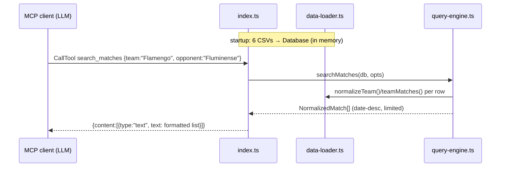

# Flow

At startup `index.ts` synchronously loads all six CSVs via `data-loader.ts` and concatenates the four match sources into one `NormalizedMatch[]`. Each MCP `CallTool` request is routed by a switch in `index.ts` to a pure function in `query-engine.ts` that filters/aggregates the in-memory arrays and returns formatted plain text. Errors are caught per-call and returned as text. Notable deviations: no dedup between the overlapping Brasileirão datasets; `searchMatches` sorts a possibly shared array in place; no input validation beyond TypeScript casts.
