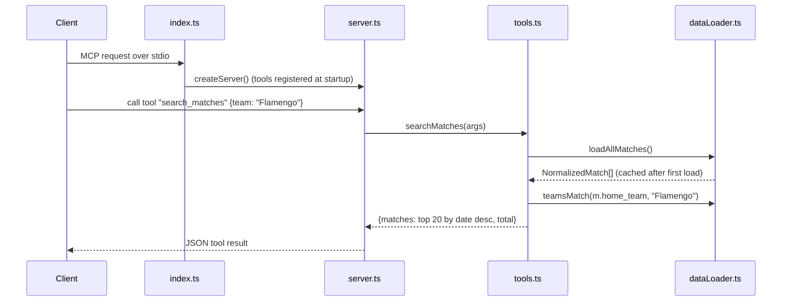

# Flow

A `search_matches` call reaches the zod-validated handler in `server.ts`, which delegates to the pure `searchMatches` in `tools.ts`. That triggers `loadAllMatches()`, which on first call parses all five match CSVs into a unified `NormalizedMatch[]` and caches it in module state (`clearCache()` resets it). Filters apply team-name fuzzy matching (`teamsMatch`, accent- and suffix-insensitive), then competition/season/date-range predicates; results are sorted date-descending and truncated to `limit` (default 20). Date filtering is string comparison on the `datetime` field, which assumes consistent ISO-style formatting across datasets. No pagination beyond `limit`; errors from malformed args are handled by zod at the MCP boundary rather than inside the query functions.
